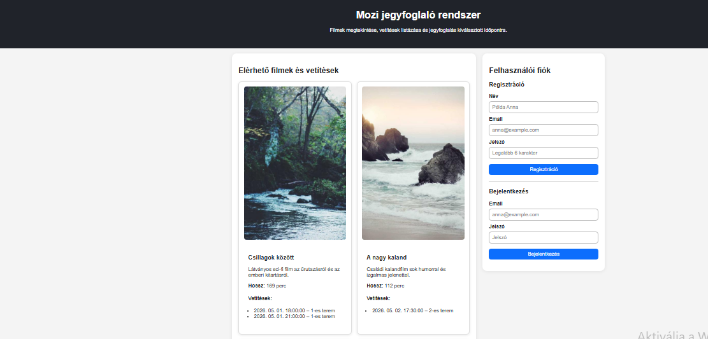
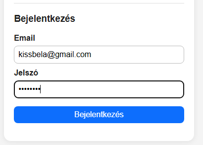
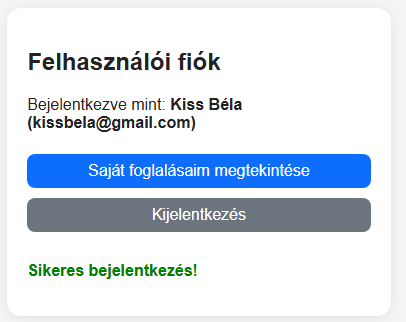
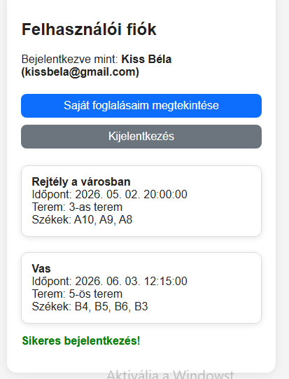
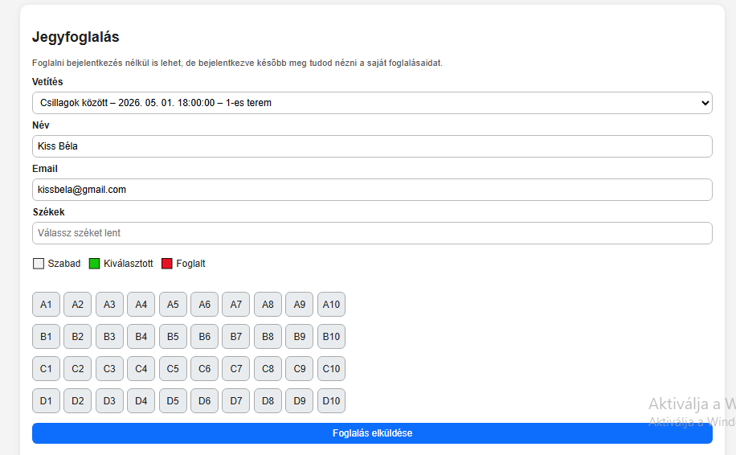
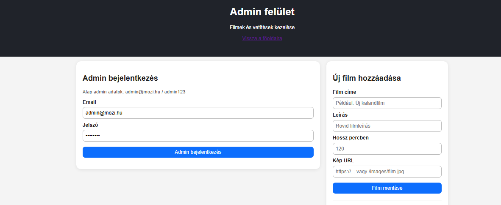
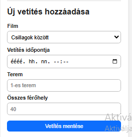
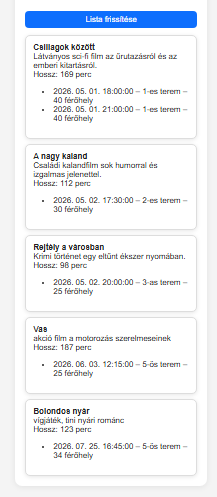

# Mozi Jegyfoglaló Rendszer

Online mozi jegyfoglaló webalkalmazás, amely lehetővé teszi a felhasználók számára a filmek megtekintését, vetítések kiválasztását és jegyek foglalását.  
A projekt Node.js, Express és SQLite használatával készült.

---

## Funkciók


### Felhasználói funkciók
- Regisztráció
- Bejelentkezés
- JWT alapú hitelesítés
- Filmek listázása
- Vetítések megtekintése
- Székfoglalás
- Saját foglalások megtekintése

### Admin funkciók
- Filmek hozzáadása
- Vetítések kezelése
- Felhasználók kezelése

---

## Képernyőképek

### Főoldal



### Bejelentkezés







### Foglalás



### Admin felület








## Használt technológiák

### Backend
- Node.js
- Express.js
- SQLite3
- Sequelize ORM
- JWT autentikáció
- bcryptjs
- dotenv

### Frontend
- HTML
- CSS
- JavaScript

### Egyéb
- GitHub
- Docker (tesztelési célból)
- Jest
- Supertest

---

## Telepítés

### Repository klónozása

```bash
git clone https://github.com/KovacsNikolett/mozi-jegyfoglalo.git
```

### Projekt mappa megnyitása

```bash
cd mozi-jegyfoglalo
```

### Függőségek telepítése

```bash
npm install
```

---

## Projekt indítása

### Normál indítás

```bash
npm start
```

---

## Alapértelmezett elérés

A szerver indítása után:

```text
http://localhost:3000
```

---

## Adatbázis

A projekt SQLite adatbázist használ Sequelize ORM segítségével.

Táblák:
- Users
- Movies
- Screenings
- Bookings

---

## API végpontok

### Filmek lekérése

```http
GET /api/movies
```

### Vetítések lekérése

```http
GET /api/screenings
```

### Regisztráció

```http
POST /api/register
```

### Bejelentkezés

```http
POST /api/login
```

### Foglalás készítése

```http
POST /api/bookings
```

---

## Tesztelés

Teszt futtatása:

```bash
npm test
```

A projekt Jest és Supertest használatával tartalmaz API teszteket.

---

## Reszponzív megjelenítés

A felület mobil és asztali nézetre is optimalizálva lett CSS Flexbox és Grid használatával.

---

## Fejlesztési cél

A projekt célja egy egyszerű online mozi jegyfoglaló rendszer létrehozása volt modern webes technológiák használatával.

---

## Készítő

Kovács Nikolett Krisztina AGCQFY

Mérnökinformatikus hallgató  
Gábor Dénes Egyetem